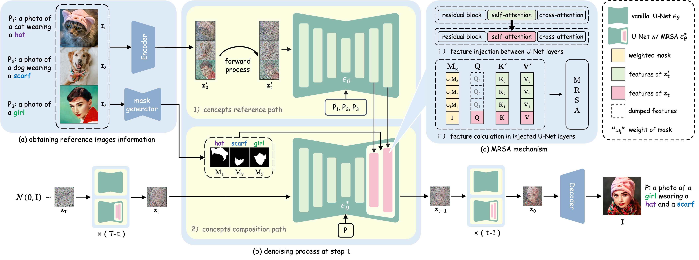

<div align="center">

<h1>FreeCustom: Tuning-Free Customized Image Generation for Multi-Concept Composition</h1>


[Ganggui Ding](https://dingangui.github.io)\*, [Canyu Zhao](https://volcverse.vercel.app)\*, [Wen Wang](https://github.com/encounter1997)\*, [Zhen Yang](https://zhenyangcs.github.io/), [Zide Liu](https://github.com/zideliu), [Hao Chen](https://scholar.google.com/citations?user=FaOqRpcAAAAJ)&#8224;, [Chunhua Shen](https://cshen.github.io/)&#8224; 

(*equal contribution, &#8224;corresponding author)

[Zhejiang University](https://www.zju.edu.cn/english/)

CVPR 2024

<a href="https://arxiv.org/abs/2405.13870">
</a>
<a href="https://aim-uofa.github.io/FreeCustom/">
</a>

</div>

## 📖 Abstract

<p>
  Benefiting from large-scale pre-trained text-to-image (T2I) generative models, impressive progress has been achieved in customized image generation, which aims to generate user-specified concepts.
  Existing approaches have extensively focused on single-concept customization and still encounter challenges when it comes to complex scenarios that involve combining multiple concepts. These approaches often require retraining/fine-tuning using a few images, leading to time-consuming training processes and impeding their swift implementation. 
  Furthermore, the reliance on multiple images to represent a singular concept increases the difficulty of customization.
</p>
<p>
  To this end, we propose <b>FreeCustom</b>, a novel tuning-free method to generate customized images of multi-concept composition based on reference concepts, using only one image per concept as input. Specifically, we introduce a new multi-reference self-attention (MRSA) mechanism and a weighted mask strategy that enables the generated image to access and focus more on the reference concepts. In addition, MRSA leverages our key finding that input concepts are better preserved when providing images with context interactions.
  Experiments show that our method's produced images are consistent with the given concepts and better aligned with the input text.
  Our method outperforms or performs on par with other training-based methods in terms of multi-concept composition and single-concept customization, but is simpler.
</p>


## 🚀 Run
1. install
```
conda create -n freecustom python=3.10 -y
conda activate freecustom
pip install -r requirements.txt
```

2. run the following command to view the results
```
python freecustom_stable_diffusion.py
```

**At this point, you can already see the customized results, but you can also try the following two methods:**
1. try another config
- replace `./configs/config_stable_diffusion.yaml` with one of configuration files in the `./datasets/freecustom/multi_concept` folder. 
- run as step 2.

2. prepare your own data
- Select 2 to 3 images that represent the concepts you wish to customize, ensuring that each concept has contextual interaction.
- Use [Grounded-Segment-Anything](https://github.com/IDEA-Research/Grounded-Segment-Anything) or other segmentation tools to obtain concept masks for filtering out irrelevant pixels.
- Store your images and masks according to the structure in the dataset folder, making sure that the filenames and extensions of the images and masks are identical.
- Modify the `./configs/config_stable_diffusion.yaml` file by updating the "ref_image_infos" and "target_prompt" fields to align with your prepared data.
- Execute `python freecustom_stable_diffusion.py` to view the results.
- Feel free to experiment with adjusting the "seeds" and "mask_weights" fields in the `./configs/config_stable_diffusion.yaml` to achieve satisfactory results.

## 🌄 Demo of customized image generation
### multi-concept composition 


### single-concept customization


Our method excels at *rapidly* generating high-quality images with multiple concept combinations and single concept customization, without any model parameter tuning. The identity of each concept is remarkably preserved. Furthermore, our method exhibits great versatility and robustness when dealing with different categories of concepts. This versatility allows users to generate customized images that involve diverse combinations of concepts, catering to their specific needs and preferences. Best viewed on screen.

## 🗓️ TODO
- [x] Release code and datasets
- [x] Release FreeCustom on Stable Diffusion pipeline and running script
- [x] Release FreeCustom on BLIP Diffusion pipeline
- [ ] Release FreeCustom on BLIP Diffusion running script
- [ ] Release FreeCustom on ControlNet pipeline and running script


## 🎫 License

The content of this project itself is licensed under [LICENSE](LICENSE).


## 🖊️ BibTeX
If you find this project useful in your research, please consider cite:

```bibtex
@inproceedings{ding2024freecustom,
  title={FreeCustom: Tuning-Free Customized Image Generation for Multi-Concept Composition}, 
  author={Ganggui Ding and Canyu Zhao and Wen Wang and Zhen Yang and Zide Liu and Hao Chen and Chunhua Shen},
  booktitle={Proceedings of the IEEE/CVF Conference on Computer Vision and Pattern Recognition},
  year={2024}
}
```

## 🙏 Acknowledgements
We thank to [Stable Diffusion](https://github.com/CompVis/stable-diffusion), [MasaCtrl](https://github.com/TencentARC/MasaCtrl), [Grounded-Segment-Anything](https://github.com/IDEA-Research/Grounded-Segment-Anything), [HuggingFace](https://huggingface.co), [Prompt-to-Prompt](https://github.com/google/prompt-to-prompt), [ControlNet](https://github.com/lllyasviel/ControlNet)

## 📧 Contact

If you have any comments or questions, please open a new issue or feel free to contact [Ganggui Ding](https://dingangui.github.io) or mail to <dingangui@zju.edu.cn>.